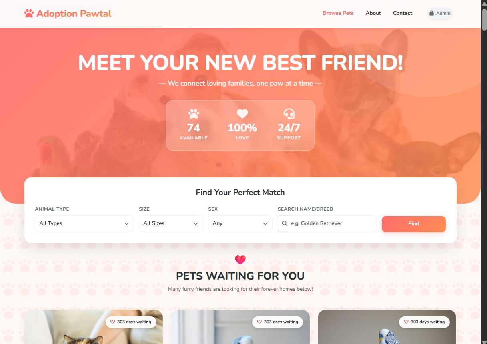

# 🐾 Adoption Pawtal

A clean and functional PHP-based pet adoption platform designed to help users browse available pets, submit adoption applications, and let admins manage listings, statuses, and notifications.

---

## ✨ Features
- Responsive and user-friendly website interface
- Pet listing and details page for visitors
- Adoption application form for interested adopters
- Admin dashboard for managing pets and applications
- Application status updates and email notifications
- Image upload support for pet profiles

---

## 📌 Project Overview
This project is made for our LBYCPG2 laboratory subject.

Contributers:
- Melanie Dotollo (Coding)
- Romela Angeline Galono (Coding)
- Xhane Batiller (Documentation)
- Zamanttha Zyrah Sahidulla (UI/UX design)

---

## 📸 Preview


---

## 🛠️ Requirements
- PHP 8.0+
- MySQL or MariaDB
- Apache or Nginx
- Composer

---

## 🚀 Getting Started
1. Start your local PHP and MySQL environment using XAMPP, WAMP, Laragon, or similar.
2. Create a database named `pet_adoption_system`.
3. Import the SQL file:

```bash
mysql -u root -p pet_adoption_system < pet_adoption_system.sql
```

4. Install Composer dependencies:

```bash
cd pet-adoption-system
composer install
```

5. Run the project using your local web server and open the app from `pet-adoption-system/public`.

---

## 📂 Project Structure
```bash
adoption-pawtal/
├── pet-adoption-system/
│   ├── admin/
│   ├── config/
│   ├── includes/
│   ├── public/
│   ├── uploads/
│   ├── composer.json
│   └── vendor/
├── pet_adoption_system.sql
├── README.md
└── .gitignore
```

---

## 🔐 Admin Access
Use the admin login page at:

`pet-adoption-system/admin/login.php`

---

## 📝 Notes
- Database configuration is stored in PHP config files, so local credentials should not be committed publicly.
- Uploaded pet images are saved under `pet-adoption-system/uploads/pets/`.

---

## 📤 GitHub Publishing
```bash
git init
git branch -M main
git add .
git commit -m "Initial commit"
git remote add origin https://github.com/YOUR_USERNAME/adoption-pawtal.git
git push -u origin main
```

Replace `YOUR_USERNAME` with your GitHub username.
